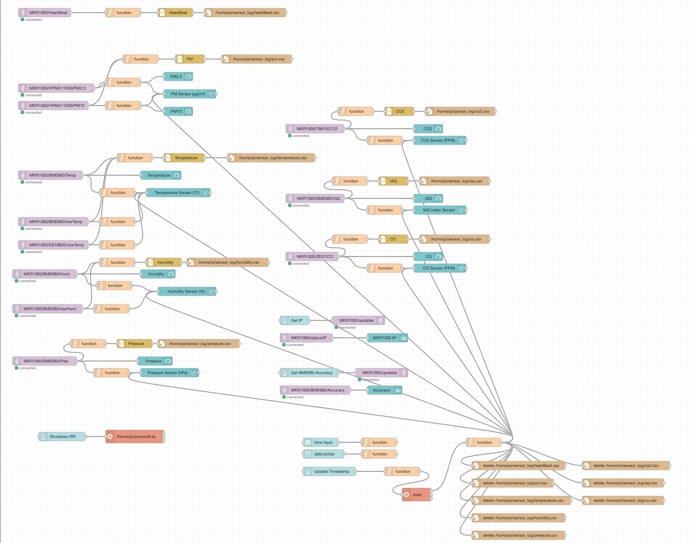

# IAQ-Monitor-MKR1000

### This repository contains a work in progress of an Indoor Air Quality Unit to easily install in your habitation.

#### Hardware:
  - 1 x [Arduino MKR1000 - MCU](https://store.arduino.cc/arduino-mkr1000-wifi)
  - 1 x [DS18B20](https://www.aliexpress.com/item/1005001636433931.html)
  - 1 x [ZE07-C0](https://www.aliexpress.com/item/4000089153741.html)
  - 1 x [Honeywell HPMA115S0](https://www.aliexpress.com/item/4000206537496.html)
  - 1 x [T6615-IR CO2](https://www.aliexpress.com/item/32960248541.html)
  - 1 x [BME680](https://www.adafruit.com/product/3660)
  
#### Software:
  - Vscode with Platformio Installed
  - Mosquitto Broker
  - Node-Red
  
#### Connections:
##### BME680 (I2C)
 - Power Supply - 3V3
 - GPIO 12 (SCL)  - SCL BME680
 - GPIO 11 (SDA)  - SDA BME680
##### DS18B20 (OneWire)
 - Power Supply - 3V3
 - GPIO 7       - DATA DS18B20 (Need 4k7 Pull-Up)
##### ZE07-CO (UART)
 - Power Supply - 5V
 - GPIO 0 (RX)  - TX ZE07 
 - GPIO 1 (TX)  - RX ZE07
##### HPMA115S0 (UART)
 - Power Supply - 5V
 - GPIO 13 (RX)  - TX HPMA115S0 
 - GPIO 14 (TX)  - RX HPMA115S0
##### T6615 (UART)
 - Power Supply - 5V
 - GPIO 3 (RX)  - TX T6615 (Need Voltage Divider)
 - GPIO 2 (TX)  - RX T6615
  
#### TODO:
- [ ] Design a board for the hardware.
- [ ] Solder all the components and re-test again.
  
#### Media:

 

